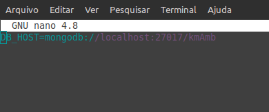

# kmAmb-backend

### instalação

```bash
   $ git clone https://github.com/theluposki/kmAmb-backend.git

   $ cd kmAmb-backend/

   $ npm install

   $ npm start
```
### configurações

  é necessario configura o arquivo ```.env```

  ```bash 
    $ nano .env
  ```

  demonstração

  